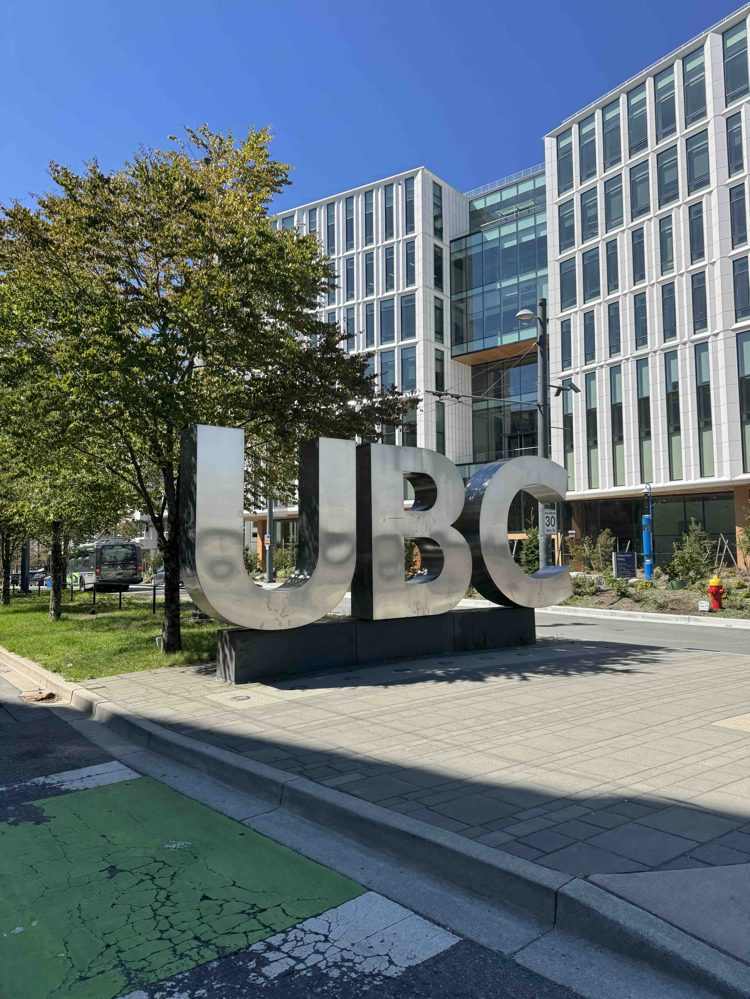

MDS moves fast. Orientation week was hectic, but super fun at the same time. I did ask myself *"What did I get myself into quite a few times"* but week one made me realise I was exactly where I'm supposed to be. 

Making friends was easy, Cohort 11 has some super cool people. I was fascinated to learn that MDS this year has students from 35+ nationalities. I dont think I have ever been in a room with such diversity. 

Coming out of a whirlwind of team-building exercises, technical workshops, and wellness sessions, both the cohort and I are fully primed to tackle the challenges ahead!
